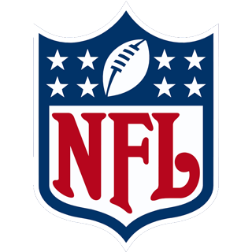

# ioBroker.nfl

## Description

An adapter for the ioBroker-system that fetches the latest NFL scores and other NFL related information.

## Current development status, limitations & future goals

### In its current state of development the adapter should be able to...

... do nothing yet. (The adapter just entered the development stage. This section will be updated, once the adapter has basic functionality.)

### In its current state of development the adapter is NOT capable of...

... anything

### Future goals:

- Acquire a list of NFL-teams and create an ioBroker object tree for them.
- Acquire a list of current and upcoming (and maybe recent/past) NFL-Games and create some sort of ioBroker object tree for them.
- Acquire stats for current (currently live) NFL-games (such as scores, game-state, etc.).
- Provide visualizations for the ioBroker-system (ioBroker.vis).

> [!NOTE]
> It is intended to implement all of the above-mentioned 'Future goals' for this adapter. 
> However, the feasibility of each of these goals is subject to change. 
> None of the functions above are 'guaranteed' to be implemented. 
> The above list is not final. Therefore, it might be altered at any time. Future goals might be added or subtracted at any time. 

## Documentation

Will follow as soon as functionality is implemented.

## DISCLAIMER

The developers of this module are in no way endorsed by or affiliated with the National Football League (NFL), ESPN, or any associated subsidiaries, logos, or trademarks.
The NFL and ESPN logos used in this adapter are for illustrative purposes only and are the property of their respective owners.
If there are any concerns regarding the use of copyrighted materials in this adapter, please feel free to contact the developers, and they will promptly address them.

## LIMITATION OF LIABILITY

The developers of this adapter shall not be liable for any damages or issues that arise from the use of the adapter, including but not limited to loss of data, malfunction, or any other damages or issues.
By using this adapter, you agree that the developers are not responsible for any costs, damages, or issues that may arise from its use.

## USAGE AGREEMENT

By using this adapter, you agree to the following terms:

-	You may use this adapter for personal or commercial purposes.
-	You may modify the adapter for your own use, but you may not redistribute it without permission from the developers.
-	The adapter is provided "as is" without any warranty, express or implied, including but not limited to the warranties of merchantability, fitness for a particular purpose, and non-infringement.
-	The developers of this adapter reserve the right to update, modify, or discontinue the adapter at any time without prior notice.
-	Any feedback or contributions provided by users are greatly appreciated but are not mandatory.
-	The developers of this adapter shall not be liable for any costs, damages, or issues that may arise from its use.

## Changelog
<!--
	Placeholder for the next version (at the beginning of the line):
	### **WORK IN PROGRESS**
-->

### **WORK IN PROGRESS**
* (Daniel Drießen) initial release

## License
MIT License

Copyright (c) 2024 Daniel Drießen <daniel.driessen@ddproductions.de>

Permission is hereby granted, free of charge, to any person obtaining a copy
of this software and associated documentation files (the "Software"), to deal
in the Software without restriction, including without limitation the rights
to use, copy, modify, merge, publish, distribute, sublicense, and/or sell
copies of the Software, and to permit persons to whom the Software is
furnished to do so, subject to the following conditions:

The above copyright notice and this permission notice shall be included in all
copies or substantial portions of the Software.

THE SOFTWARE IS PROVIDED "AS IS", WITHOUT WARRANTY OF ANY KIND, EXPRESS OR
IMPLIED, INCLUDING BUT NOT LIMITED TO THE WARRANTIES OF MERCHANTABILITY,
FITNESS FOR A PARTICULAR PURPOSE AND NONINFRINGEMENT. IN NO EVENT SHALL THE
AUTHORS OR COPYRIGHT HOLDERS BE LIABLE FOR ANY CLAIM, DAMAGES OR OTHER
LIABILITY, WHETHER IN AN ACTION OF CONTRACT, TORT OR OTHERWISE, ARISING FROM,
OUT OF OR IN CONNECTION WITH THE SOFTWARE OR THE USE OR OTHER DEALINGS IN THE
SOFTWARE.
